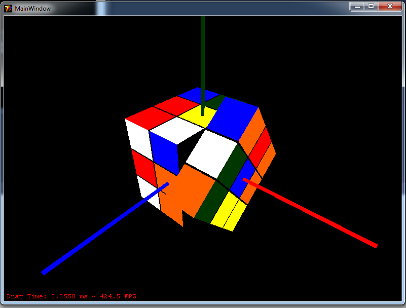

NCubeSolver
===========

NCubeSolver is a very small project put together that is designed to solve the classic Rubiks Cube puzzle.
It is built with extensibility in mind in the hope that extra displays, solvers, external controls and cube configurations can be slotted in.

There are two main programs within the solution, the main runner program which loads the specified plugins from the extensions directory and uses them to scramble a cube, calculate the solution and then replay that solution on an attached display.

The other program is a WPF screen saver application that when installed, can be chosen as the Windows screensaver that will run through the same Scramble-Solve-Display procedure.

### Screenshots

